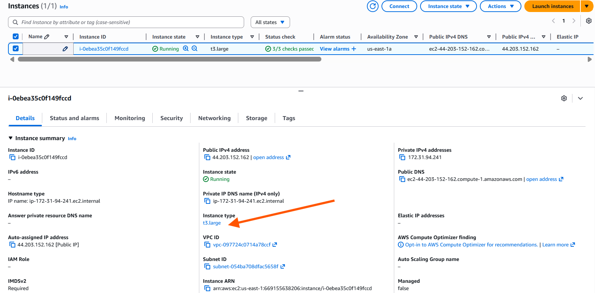
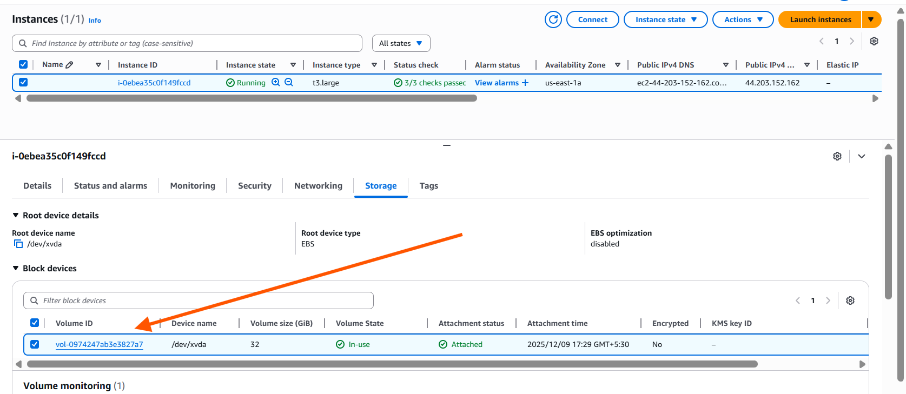
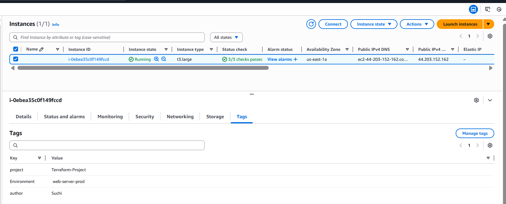
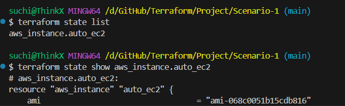

# **Scenario 1: Automate EC2 Configuration Based on Environment (dev / qa / prod)**

Automatically change EC2 settings based on the chosen environment.
When the user selects `dev`, `qa`, or `prod`, Terraform must update:

* EC2 **instance type**
* EC2 **tags**
* EBS **volume size**

### **Terraform concept used Used**

* `variables`
* `locals`
* `conditional expressions`

---

# **Folder Structure**

```
scenario-1/
    main.tf
    variable.tf
```

---

# **Steps to Run the Project**

### **1️ Initialize Terraform**

```bash
terraform init
```

---

### **2️ Validate before applying**

```bash
terraform plan
```

---

### **3️ Apply according to the environment**

```bash
terraform apply -var="environment=dev"
terraform apply -var="environment=qa"
terraform apply -var="environment=prod"
```

---

### **4️ Destroy resources**

```bash
terraform destroy
```

---

#  **What the Automation Does**

| Environment | Instance Type | Volume Size | Name Tag    |
| ----------- | ------------- | ----------- | ----------- |
| dev         | t2.micro      | 8 GB        | dev-server  |
| qa          | t2.small      | 16 GB       | qa-server   |
| prod        | t3.large      | 32 GB       | prod-server |

Terraform dynamically assigns these values based on conditional logic — **no repetitive code needed**.

---

# **Validation (Example with prod environment)**

Running:

```bash
terraform apply -var="environment=prod"
```

Terraform correctly produced:

### **Instance Type**



---

### **EBS Volume**



---

### **Tags**



---

### **State Validation via CLI**

You can confirm values using:

```bash
terraform state list
terraform state show aws_instance.auto_ec2
```



---
