# **Scenario 10: Custom VPC Deployment (Public & Private Subnets)**

This project demonstrates how to design and deploy a **secure and production-style AWS VPC architecture** using Terraform, with proper network isolation and controlled internet access.

The setup follows **AWS best practices** by separating public and private workloads and routing traffic appropriately using an **Internet Gateway (IGW)** and **NAT Gateway**.

---

## **Architecture Overview**

### **Components Created**

* **1 Custom VPC**
* **Public Subnet**

  * Internet Gateway (IGW) attached to the VPC
  * NAT Gateway deployed inside the public subnet
  * Public EC2 instance with a public IP
* **Private Subnet**

  * No public IP assigned
  * Private EC2 instance
  * Internet access provided **only via NAT Gateway**

---

## **Network Design Rules**

* Public subnet routes internet traffic using **Internet Gateway**
* Private subnet routes outbound internet traffic using **NAT Gateway**
* No inbound internet access is allowed to private subnet instances
* NAT Gateway enables **outbound-only** internet access for private resources

This design ensures **security, isolation, and controlled exposure** of resources.

---

## **Traffic Flow**

### **Public EC2 Instance**

```
Public EC2
 → Public Subnet
 → Internet Gateway (IGW)
 → Internet
```

### **Private EC2 Instance**

```
Private EC2
 → Private Route Table
 → NAT Gateway (in Public Subnet)
 → Internet Gateway
 → Internet
```

---

## **Steps to Run the Project**

```bash
terraform fmt
terraform validate
terraform init
terraform plan -var-file=input.tfvars
terraform apply -var-file=input.tfvars
```

---

## **Validation & Verification**

### **Terraform Output**

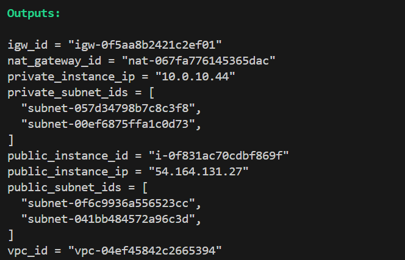

---

### **VPC**

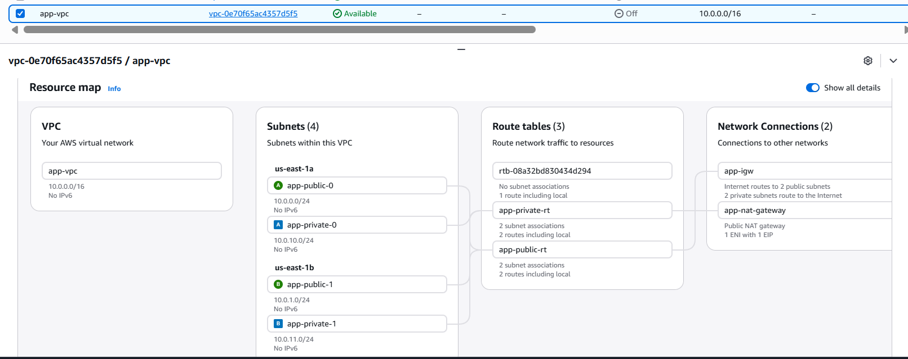

---

### **Subnets**

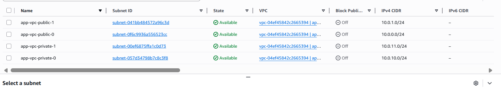

---

### **Route Tables**

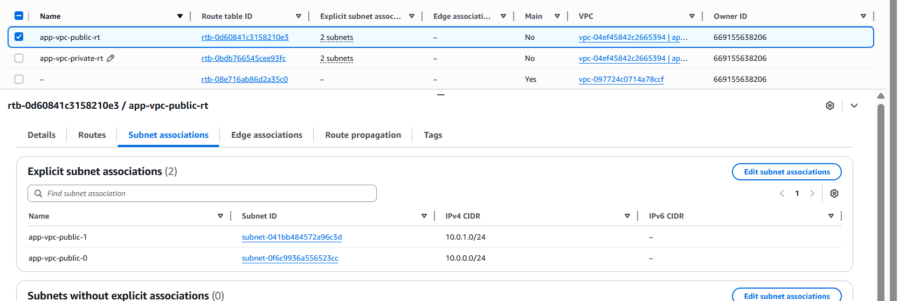

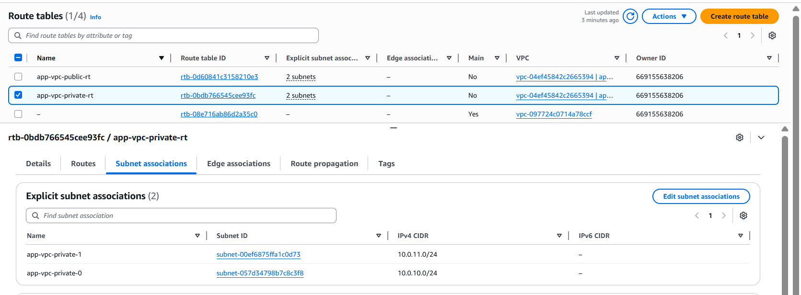

---

### **Routes**

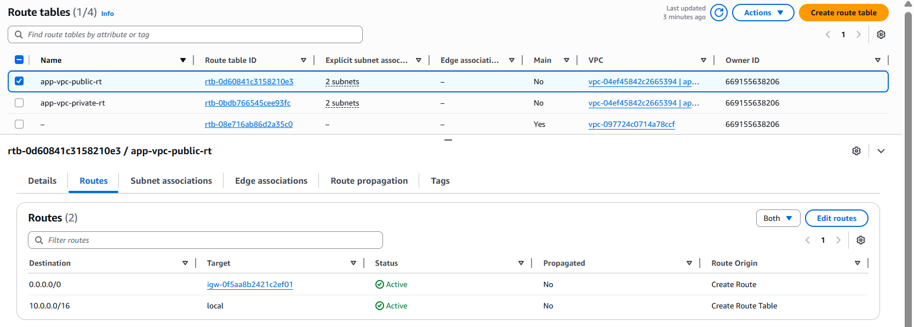

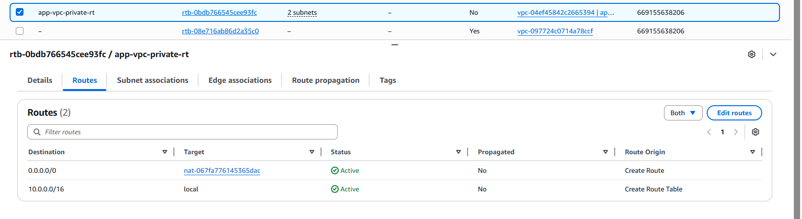

---

### **Internet Gateway**

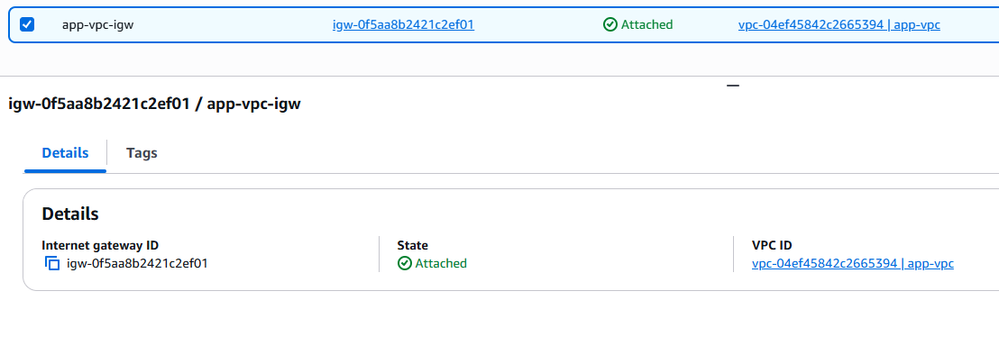

---

### **NAT Gateway**

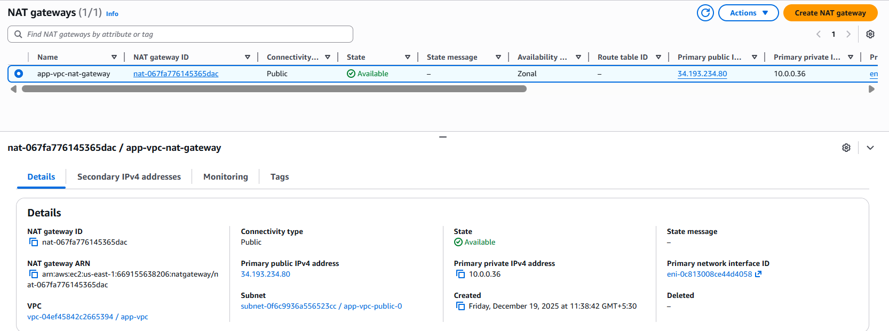

---

### **Public EC2 Instance**

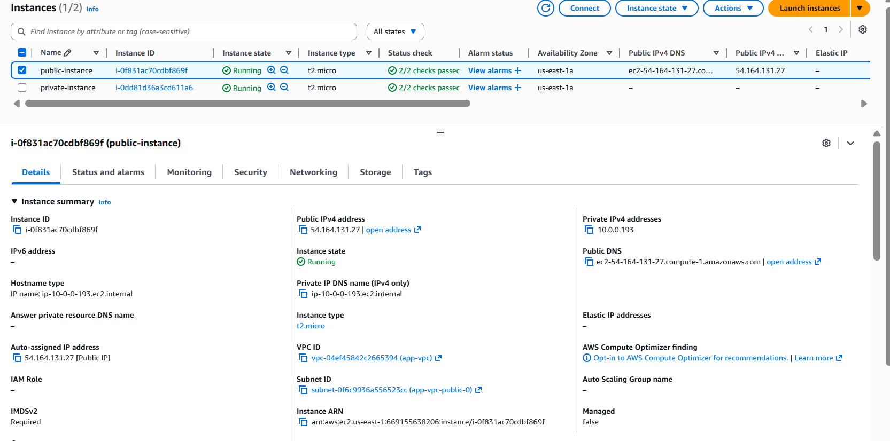

---

### **Private EC2 Instance**

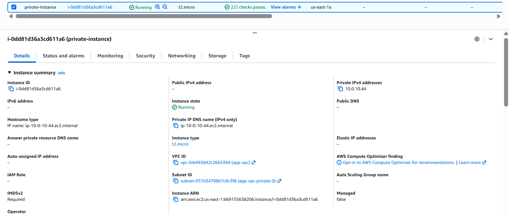

---
