# Scenario 11: Highly Available Web Application on AWS (Terraform)

This project demonstrates deployment of a **secure, scalable, and highly available web application on AWS** using **Terraform** and AWS best practices.

The application is deployed using **Docker containers** on EC2 instances managed by an **Auto Scaling Group**, with traffic routed securely through an **Application Load Balancer (ALB)** over **HTTPS**.

---

## Architecture Overview

```
Route 53 (DNS)
   |
ACM (SSL Certificate)
   |
Application Load Balancer (ALB)
   |
Auto Scaling Group (ASG)
   |
EC2 Instances (Dockerized Web Application)
```

---

## Terraform Components

### 1️ Networking Layer

* Custom **VPC**
* **Public Subnets**

  * Application Load Balancer
  * Internet Gateway
* **Private Subnets**

  * EC2 instances (no public IPs)
* **NAT Gateway**

  * Outbound internet access for private instances
* **Route Tables**

  * Public → IGW
  * Private → NAT Gateway

---

### 2️ Security Layer

* **Security Groups**

  * ALB: Allows inbound HTTP (80) & HTTPS (443)
  * EC2: Allows traffic only from ALB
* **IAM Role for EC2**

  * AWS Systems Manager (SSM) access
* (Optional) Network ACLs

---

### 3️ Compute Layer

* **Launch Template**

  * Amazon Linux
  * Docker installation via User Data
  * Application container deployment
* **Auto Scaling Group**

  * Minimum, desired, and maximum capacity
  * Multi-AZ deployment
  * Health check–based instance replacement

---

### 4️ Load Balancing Layer

* **Application Load Balancer (ALB)**
* **Target Group**

  * Health checks on `/`
* **Listeners**

  * HTTP (80) → Redirect to HTTPS (443)
  * HTTPS (443) → Forward to Target Group

---

### 5️ DNS & SSL Layer

* **Route 53 Hosted Zone**
* **ACM Certificate**

  * DNS-based validation
* **HTTPS enabled**

  * Secure access using SSL/TLS

---

## Deployment Flow

1. Terraform provisions VPC, subnets, and networking
2. ACM issues SSL certificate using Route53 DNS validation
3. ALB is created with HTTPS listener
4. Auto Scaling Group launches EC2 instances in private subnets
5. Docker installs automatically and runs the web application
6. Route53 routes traffic to ALB
7. Application becomes publicly accessible over HTTPS

---

## **Steps to Run the Project**

```bash
terraform fmt
terraform validate
terraform init
terraform plan -var-file=input.tfvars
terraform apply -var-file=input.tfvars
```

---

## Validation

### Terraform Output

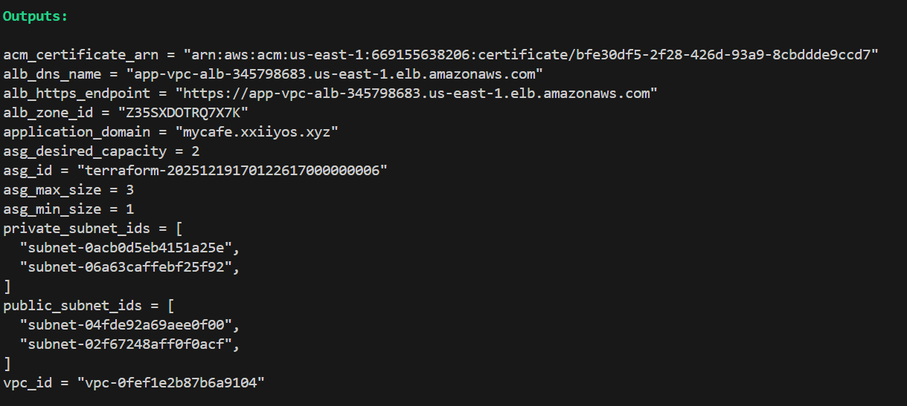

### VPC

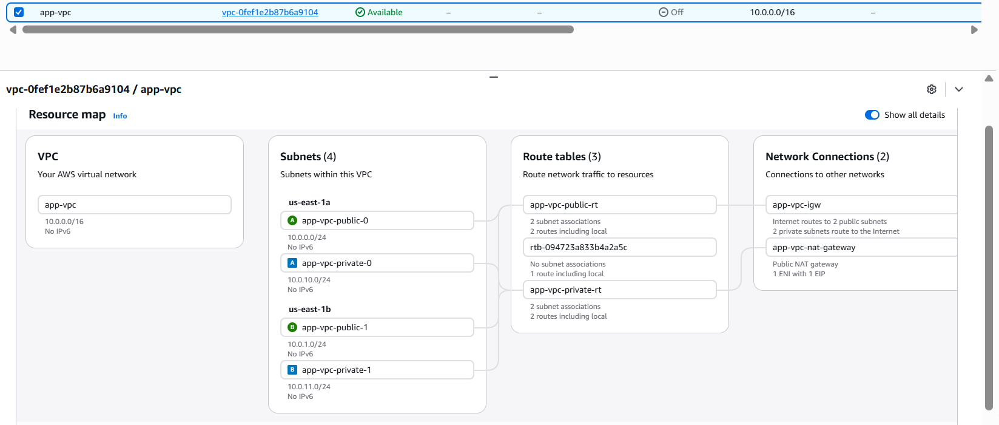

### Route53 DNS Entry

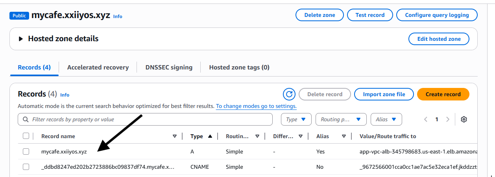

### ACM Certificate

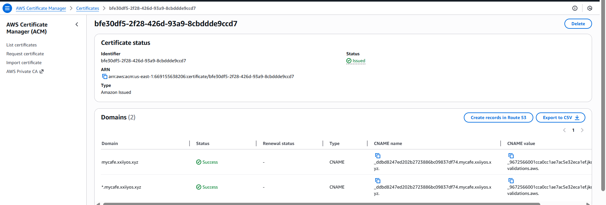

### Auto Scaling Group

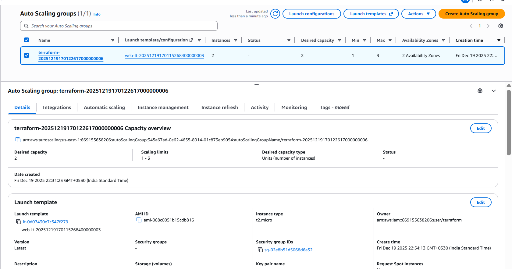

### ASG Instances

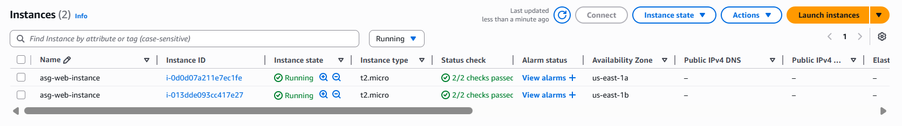

### Launch Template

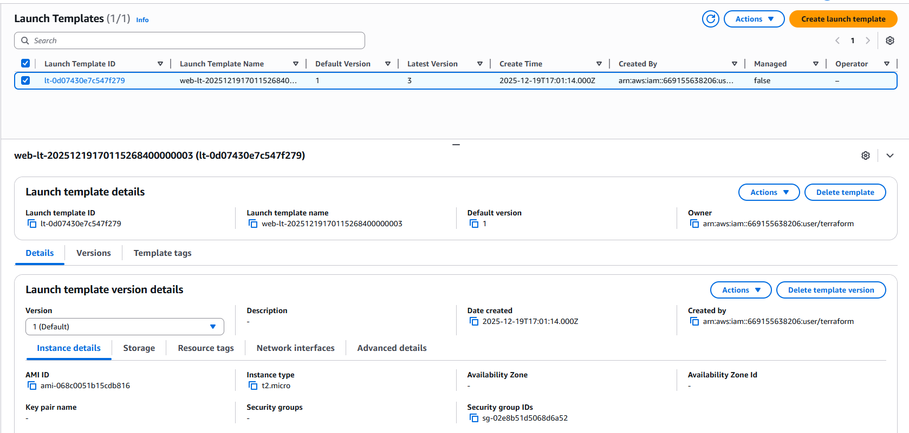

### Application Load Balancer


### ALB Listeners (HTTP → HTTPS)

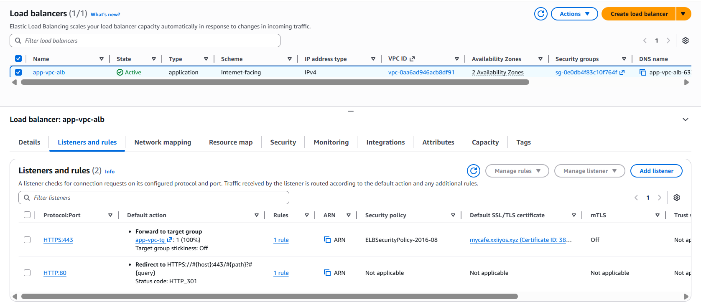

### Target Group (Healthy Instances)


### EC2 IAM Role (SSM)

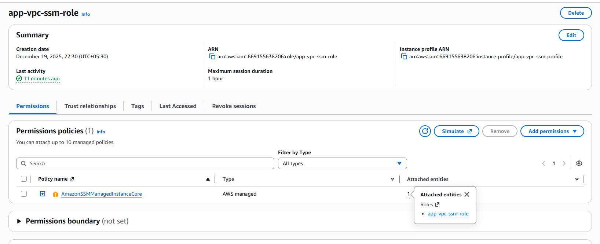

### Docker Running Inside Instance

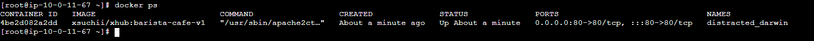

### Final Website (HTTPS)

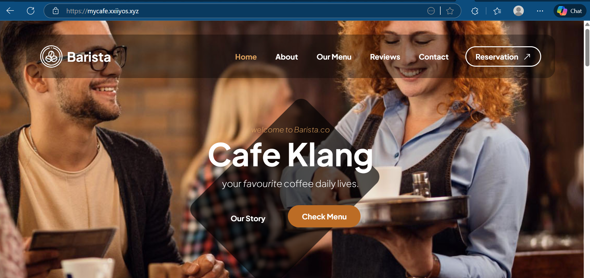

---

## Tools & Technologies Used

* **Terraform**
* **AWS**

  * VPC, EC2, ALB, Auto Scaling
  * Route53, ACM
  * IAM, SSM
* **Docker**
* **Linux**
* **Infrastructure as Code (IaC)**

## Cleanup

```bash
terraform destroy -var-file=input.tfvars
```

