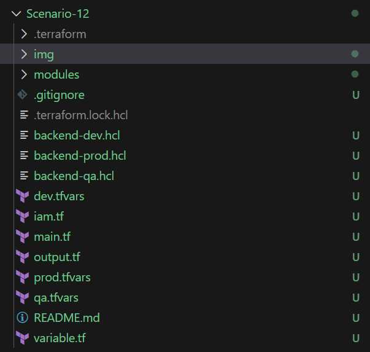
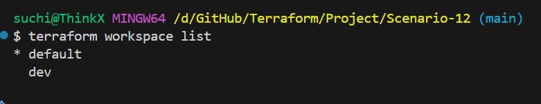
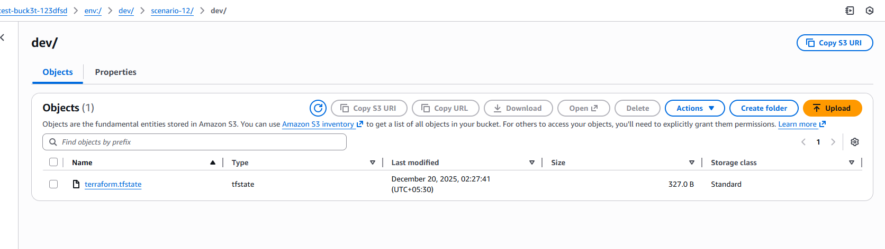
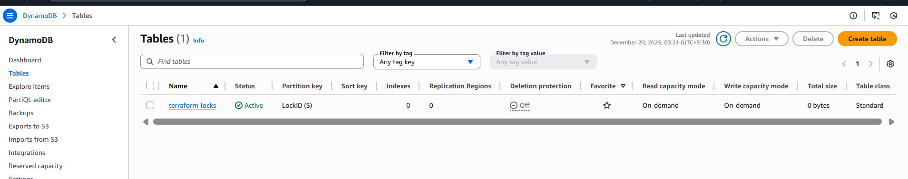
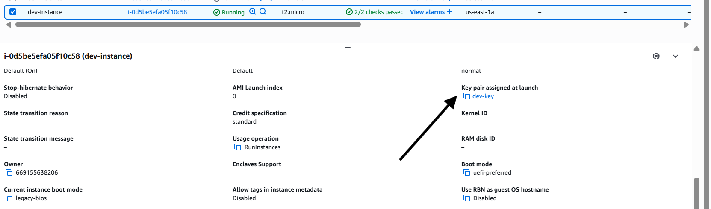
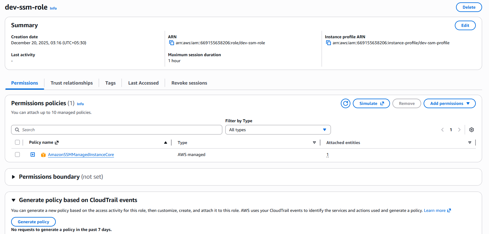
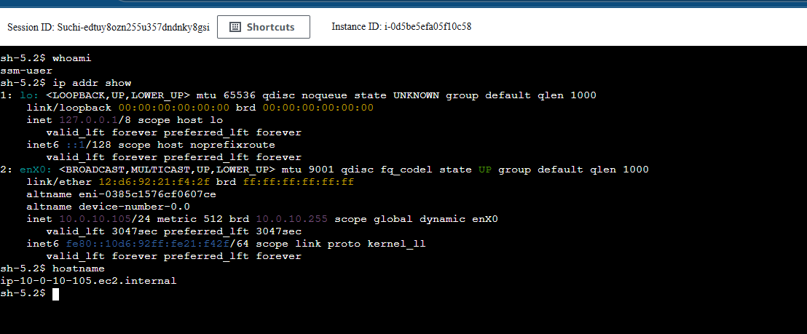

#  Scenario 12: Secure EC2 Access with Locally Managed SSH Keys & Remote Terraform State

##  Objective

Implement **secure EC2 access and Terraform state management** using best practices:

* Generate **SSH key pair locally**
* Upload **only the public key** to AWS
* Use the key securely with EC2
* Create **dev / qa / prod Terraform workspaces**
* Store Terraform state in **remote S3 backend**
* Enable **state locking with DynamoDB**
* Prevent accidental state corruption and ensure safe collaboration

---

## Architecture Overview

```
Local Machine
   |
   |-- Terraform
   |     |
   |     |-- Local SSH Key Generation (TLS Provider)
   |     |-- Public Key Upload to AWS (EC2 Key Pair)
   |
AWS
 ├── S3 Bucket (Remote Terraform State)
 ├── DynamoDB (State Locking)
 ├── IAM Role (SSM Managed Instance)
 ├── VPC
 │    ├── Public Subnet (NAT Gateway)
 │    └── Private Subnet (EC2 Instance)
 └── EC2 Instance (Private, SSM Access Only)
```

---

## Terraform Components

### 1️ Key Pair Module

* Generates SSH key **locally**
* Uploads **only public key** to AWS
* Stores private key securely on local machine

### 2️ VPC Module

* Custom VPC
* Public & Private subnets
* Internet Gateway & NAT Gateway
* Route tables and associations

### 3️ EC2 Module

* Private EC2 instance (no public IP)
* Security group with **no inbound rules**
* IAM instance profile for **AWS Systems Manager (SSM)** access

### 4️ Remote Backend

* S3 bucket for Terraform state
* DynamoDB table for state locking
* Separate state file per workspace (dev / qa / prod)

---

## Deployment Flow

1. Create remote backend (S3 + DynamoDB)
2. Initialize Terraform with backend configuration
3. Create environment-specific workspace
4. Generate SSH key locally
5. Launch EC2 instance in private subnet
6. Access instance securely via **SSM Fleet Manager**
7. Terraform state stored & locked remotely

---

##  Steps to Run the Project

```bash
terraform fmt
terraform validate

terraform init -backend-config=backend-dev.hcl

terraform workspace new dev
terraform workspace list
terraform workspace select dev

terraform plan -var-file=dev.tfvars
terraform apply -var-file=dev.tfvars
```

---

##  Validation

### Terraform Output



### Workspace Validation



### S3 Remote State File



### DynamoDB State Lock



### VPC Resources


### EC2 Key Pair



### IAM SSM Role



### Fleet Manager – Managed Node


### Session Manager Access



---

## Tools & Technologies Used

* **Terraform**
* **AWS EC2**
* **AWS VPC**
* **AWS S3 (Remote Backend)**
* **AWS DynamoDB (State Locking)**
* **AWS IAM**
* **AWS Systems Manager (SSM)**
* **TLS Provider**
* **Local File Provider**
* **Terraform Workspaces**

---

## Security Best Practices Followed

* No SSH access from internet
* EC2 launched in **private subnet**
* Access only via **SSM Session Manager**
* Private SSH key **never uploaded to AWS**
* Terraform state **not stored locally**
* DynamoDB locking prevents concurrent state corruption

### Private Key Handling
- SSH private key is generated and stored locally using Terraform
- Only the public key is uploaded to AWS
- Private key is never stored in Terraform state or S3 backend
- Access to EC2 is handled securely using AWS SSM Session Manager
---

## Cleanup

```bash
terraform destroy -var-file=dev.tfvars
```

---