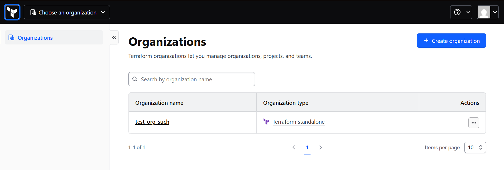
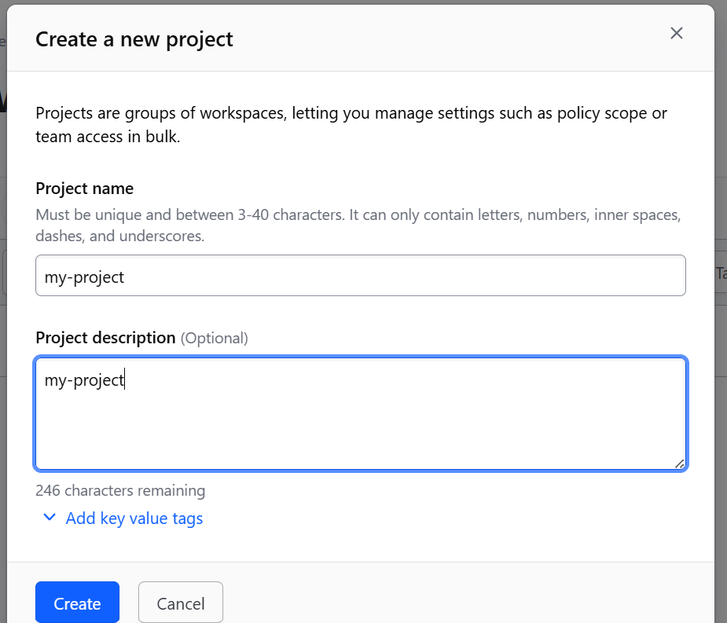
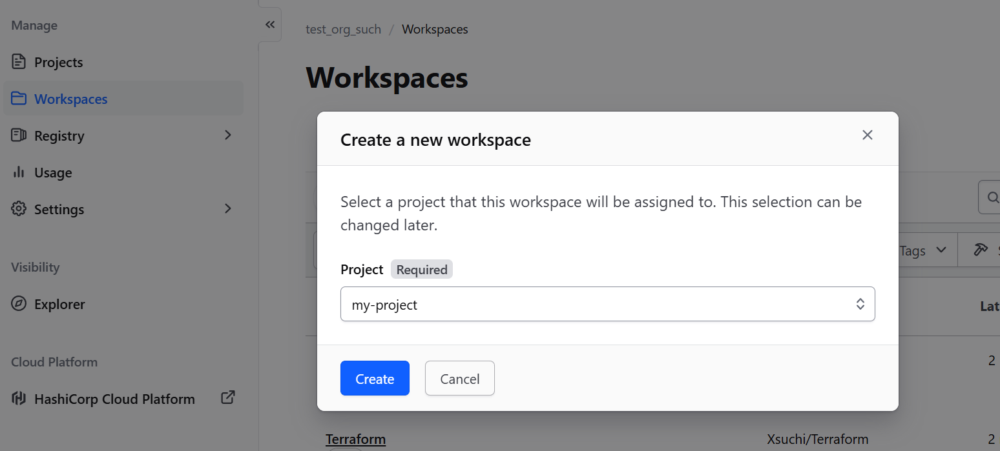
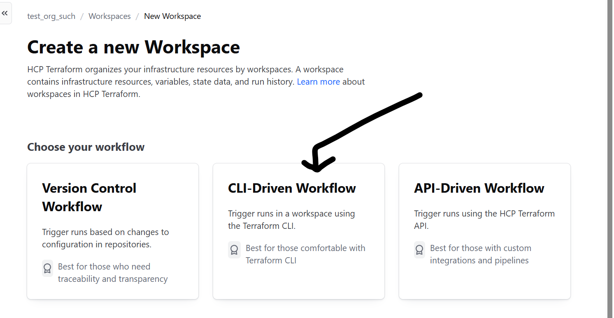
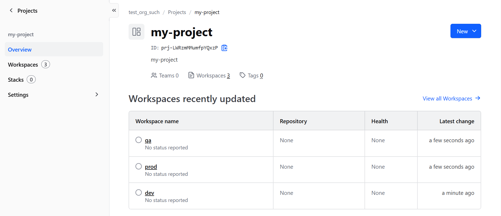
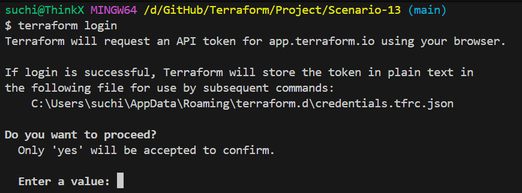
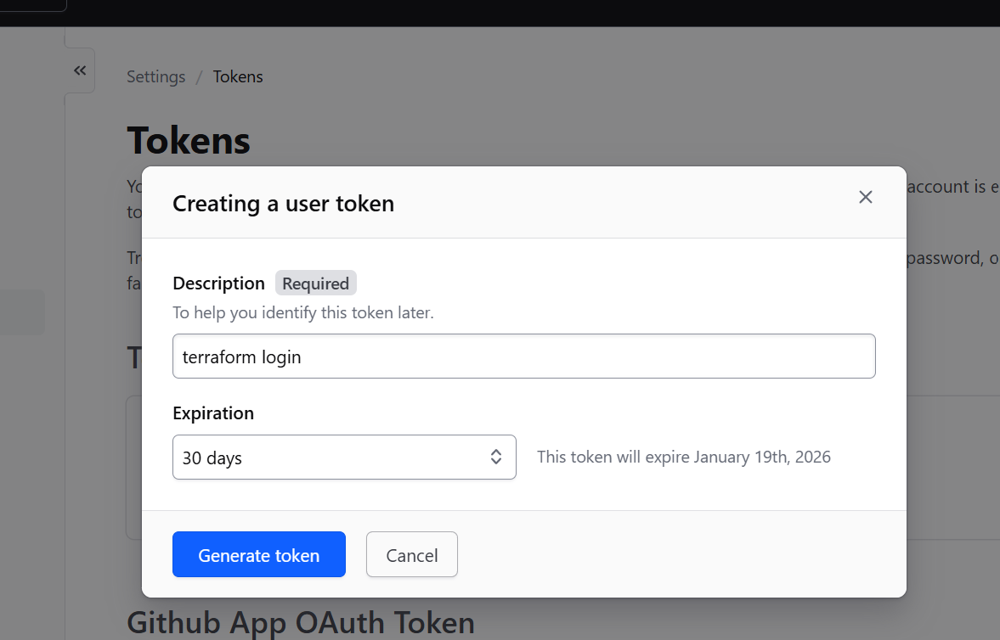
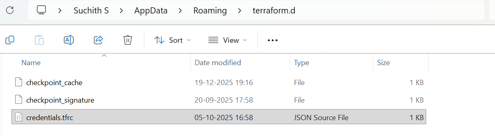

# Terraform Cloud – Backend Setup Reference

This document explains how to set up **Terraform Cloud** as a **remote backend** for Terraform projects.
It is intended as a **reference guide** for anyone using this repository.

> This folder does **not** deploy infrastructure.
> It only explains how to configure Terraform Cloud for backend, state, and execution.

---

## Setup Flow

---

## Task 1: Create a Terraform Cloud Account

1. Go to [https://app.terraform.io](https://app.terraform.io)
2. Sign up using **Gmail** or **GitHub**
3. Create an **Organization**

   * Example: `my-organization`
4. create an **project** under the organization
    * Example: `my-project`
5. Inside the organization, create **workspaces**

   * `dev`
   * `qa`
   * `prod`

Each workspace maintains a **separate remote state file**.

## example









---

## Task 2: Login from Terraform CLI

On your local system (Windows / Linux / macOS):

```bash
terraform login
```

Steps:

1. Terraform opens a URL in the browser
2. Login to Terraform Cloud
3. Generate and copy the **API token**
4. Paste it back into the CLI




Terraform stores the credentials locally at:

* **Linux / macOS**

  ```
  ~/.terraform.d/credentials.tfrc.json
  ```

* **Windows**

  ```
  %APPDATA%\terraform.d\credentials.tfrc.json
  ```

---

## Task 3: Configure Terraform Cloud Backend in Code

Backend configuration is defined inside Terraform code.

Refer to **Scenario-13** for the exact backend configuration used in this repository.

> Once Terraform Cloud is configured, state is stored and locked automatically.

---

## Task 4: Add Variables Securely

In **Terraform Cloud UI**:

```
Workspace → Variables tab
```

You can define:

### Terraform Variables

* Used inside `.tf` files
* Example: `region`, `db_password`

### Environment Variables

* Commonly used for provider credentials

### Example

| Name                  | Value        | Type          |
| --------------------- | ------------ | ------------- |
| AWS_ACCESS_KEY_ID     | ABCDXXXXXXXX | Sensitive     |
| AWS_SECRET_ACCESS_KEY | XXXXXXXXX    | Sensitive     |
| region                | us-east-1    | Non-sensitive |

> Best Practice:
> Never commit secrets into Git or `.tfvars` files.

---

## Task 5: Ways to Run Terraform

Terraform Cloud supports **three execution models**.

---

### Option 1: CLI-Driven Run (Local Trigger)

```bash
terraform plan
terraform apply
```

* Commands run from local machine
* Execution happens in Terraform Cloud
* Logs stream back to terminal

---

### Option 2: UI-Driven Run (Remote)

* Run **Plan** and **Apply** directly from Terraform Cloud UI
* Access controlled via **RBAC**

---

### Option 3: VCS-Driven Run (Fully Automated)

* Connect workspace to GitHub / GitLab / Bitbucket
* Every push triggers:

  * Automatic `terraform plan`
  * Approval workflow
  * `terraform apply`

Ideal for **CI/CD and team collaboration**.

---

## Task 6: Destroy Infrastructure

You can destroy resources using:

```bash
terraform destroy
```

Or directly from **Terraform Cloud UI**.

* All destroy actions are logged
* State is updated automatically

---

## Notes

* Terraform Cloud replaces manual S3 + DynamoDB backend setup
* State locking, encryption, and versioning are handled automatically
* This document is a **reference guide**, not an executable scenario