# Scenario 14: Enforce Terraform Cloud–Only Execution & Workspace-Based Infrastructure with Slack Notifications

## Objective

Build a **secure Terraform workflow** where:

* Terraform **state and execution are centralized in Terraform Cloud**
* **Sensitive variables are never stored locally**Sensitive variables are securely stored in Terraform Cloud 
* Infrastructure behavior **automatically changes per workspace** (`dev`, `qa`, `prod`)
* **Developers cannot apply or destroy infrastructure locally**
* All changes are **auditable, controlled, and remotely executed**
* **Slack notifications** alert the team on Terraform runs (apply/destroy/errors)

---

## Architecture Overview

```
Developer CLI
     |
     | (Triggers only)
     v
Terraform Cloud (Remote Execution)
     |
     |-- Secure Variables
     |-- Remote State
     |-- Audit Logs
     |-- Slack Notifications
     |
     v
AWS Infrastructure
```

---

## Workspace-Based EC2 Configuration

Terraform dynamically adjusts EC2 configuration based on the **active workspace**:

| Environment | Instance Type | EBS Volume Size |
| ----------- | ------------- | --------------- |
| dev         | t2.micro      | 8 GB            |
| qa          | t2.small      | 16 GB           |
| prod        | t3.large      | 32 GB           |

---

## Terraform Concepts Used

* `terraform cloud` backend
* `terraform.workspace`
* `locals`
* `conditional expressions`
* Workspace-based variable isolation
* Remote execution mode
* Secure backend variables
* Terraform Cloud notifications

---

## Step 1: Configure AWS Credentials in Terraform Cloud

Since **execution happens in Terraform Cloud**, AWS credentials **must not exist locally**.

### Steps:

1. Terraform Cloud → **Organization** → **Workspace**
2. Go to **Variables**
3. Add **Environment Variables**:

| Name                  | Type      |
| --------------------- | --------- |
| AWS_ACCESS_KEY_ID     | Sensitive |
| AWS_SECRET_ACCESS_KEY | Sensitive |

4. Add **Terraform Variables**:

| Name   | Value     | Type          |
| ------ | --------- | ------------- |
| region | us-east-1 | Non-sensitive |
| ami_id | ami-xxxx  | Sensitive     |

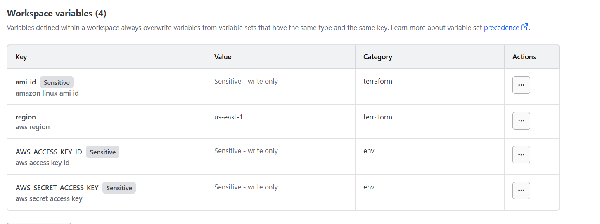

**Repeat this per workspace (`dev`, `qa`, `prod`) as required**

---

## Step 2: Configure Terraform Cloud Backend

Add this to `main.tf`:

```hcl
terraform {
  cloud {
    organization = "test_org_such"

    workspaces {
      name = "dev"
    }
  }
}
```

Use **separate workspaces** for:

* `dev`
* `qa`
* `prod`

---

## Step 3: Enforce Remote-Only Execution

In Terraform Cloud:

```
Workspace → Settings → Execution Mode → Remote (custom)
```

### What this enforces

| Action            | Behavior                |
| ----------------- | ----------------------- |
| terraform plan    | Runs in Terraform Cloud |
| terraform apply   | Runs in Terraform Cloud |
| terraform destroy | Runs in Terraform Cloud |
| Local AWS creds   | ❌ Not used              |
| Local state file  | ❌ Not created           |

The CLI only **triggers** runs — execution never happens locally.

---
## Example Output (Local CLI)

```bash
terraform apply
```

Output:

```
Running apply in HCP Terraform...
Preparing the remote apply...
To view this run in a browser:
https://app.terraform.io/app/test_org_such/dev/runs/xxxx
```

Execution happens on **Terraform Cloud**, not your machine.

---

## Step 4: Integrate Terraform Cloud Notifications with Slack

### 1️ Create Slack Channel

* Create a Slack channel (example: `terraform_alerts`)
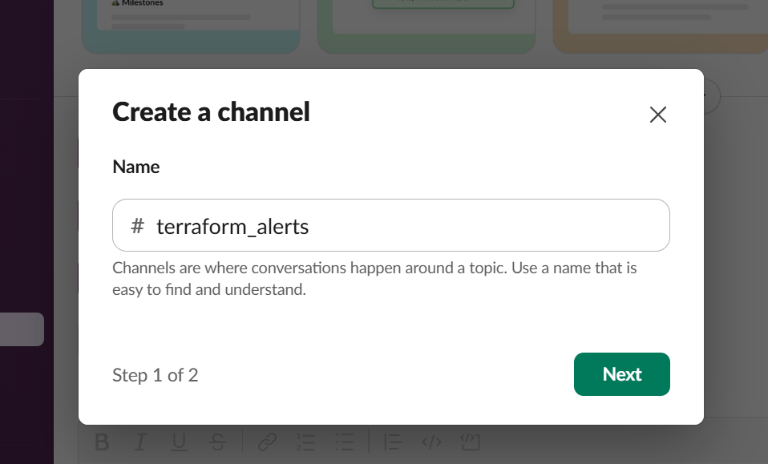

### 2️ Create Slack App

* Go to: [https://api.slack.com/apps](https://api.slack.com/apps)
* Click **Create New App → From Scratch**
* App name: `terraform_alerts`
* Choose your Slack workspace

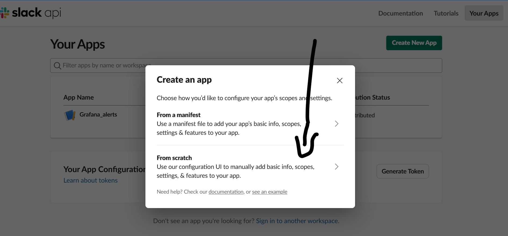
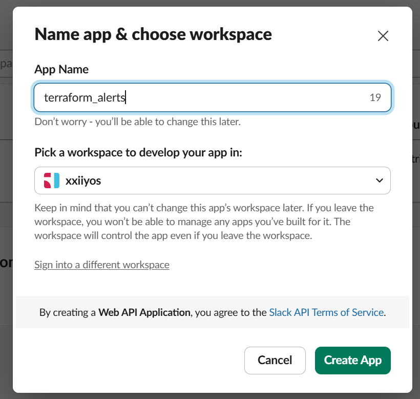

### 3️ Enable Incoming Webhooks

* Go to **Incoming Webhooks**
* Turn **Activate Incoming Webhooks → ON**
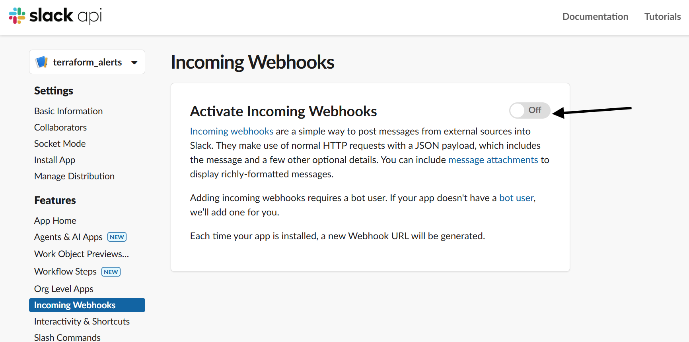
* Click **Add New Webhook to Workspace**
* Select `terraform_alerts` channel
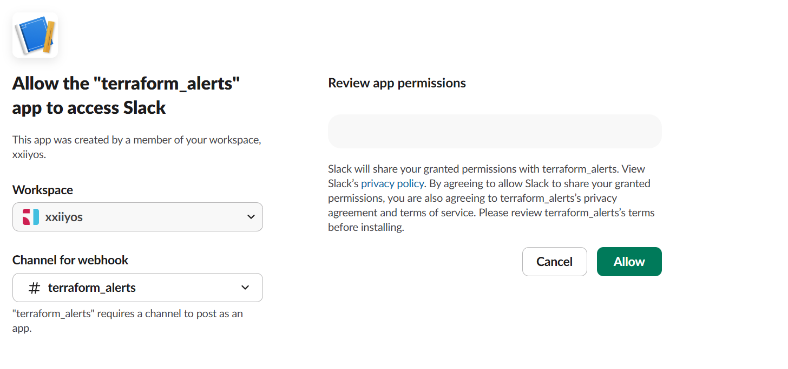
* Copy the **Webhook URL**
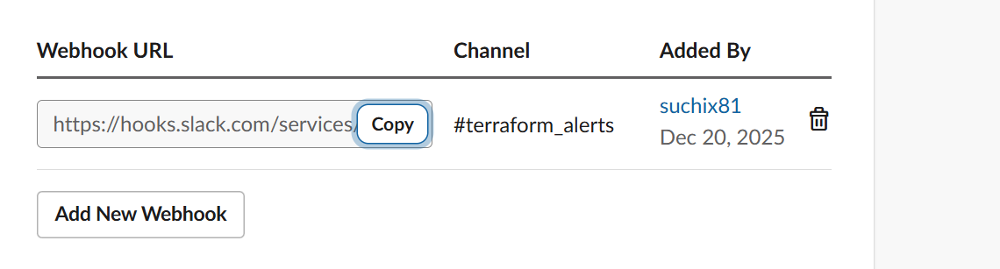
---

### 4️ Configure Slack in Terraform Cloud

1. Terraform Cloud → **Workspace**
2. Go to **Settings → Notifications**
3. Click **Create Notification**
4. Choose **Slack**
5. Paste the Webhook URL
6. Select triggers:

   * `run:completed` → successful apply/destroy
   * `run:errored` → failures

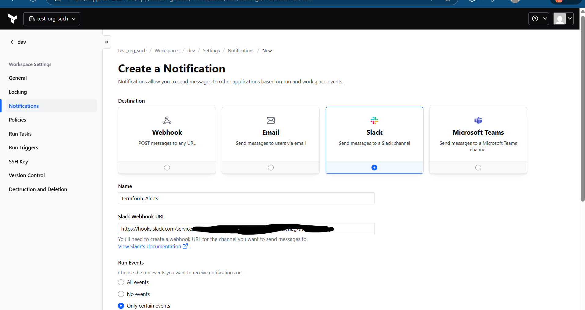
---

##  Validation

### Terraform Cloud Run

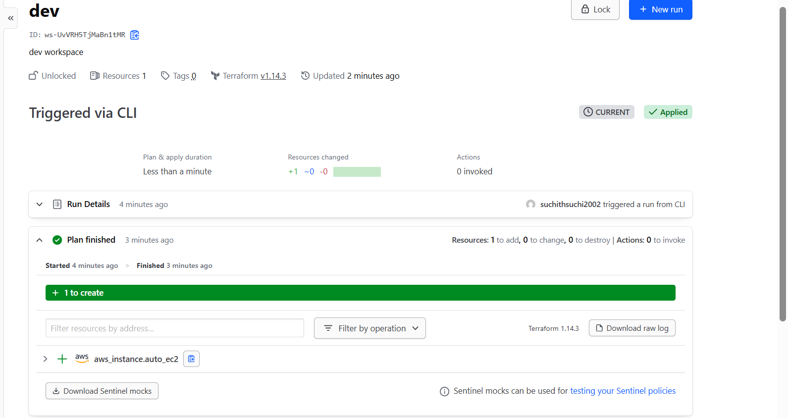
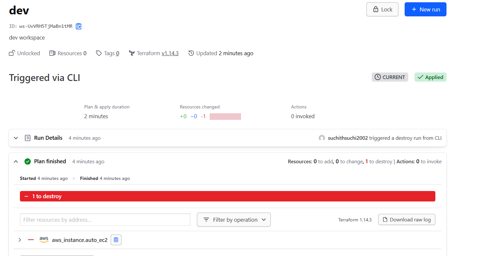

### Local CLI Output (Remote Execution)

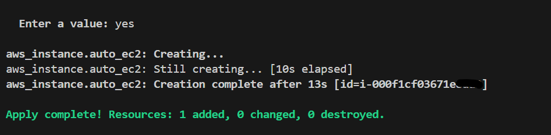

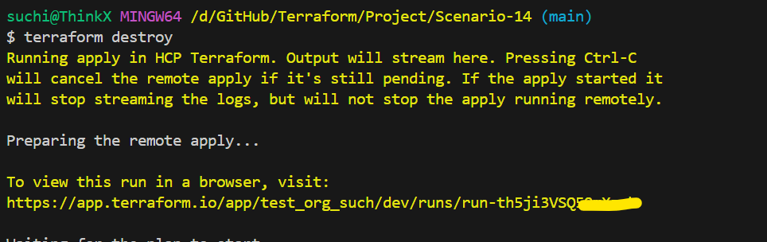

## slack notification

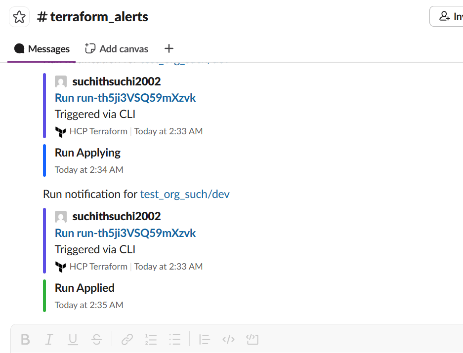

---

## NOTE

> Terraform Cloud **does not block the CLI command itself**.

What it **actually enforces**:

* ❌ No local execution
* ❌ No local state
* ❌ No local credentials
* ✅ All plans/applies run remotely
* ✅ Full audit logs
* ✅ Controlled access

---

## Security Benefits Achieved

✔ No local state files
✔ No local AWS credentials
✔ Centralized execution
✔ Workspace-based isolation
✔ Full audit trail
✔ Safe for team collaboration

---

## Summary

This scenario demonstrates:

* Enterprise-grade Terraform Cloud usage
* Secure variable management
* Workspace-driven infrastructure
* Remote-only execution
* Real-time Slack alerts for infrastructure changes

---