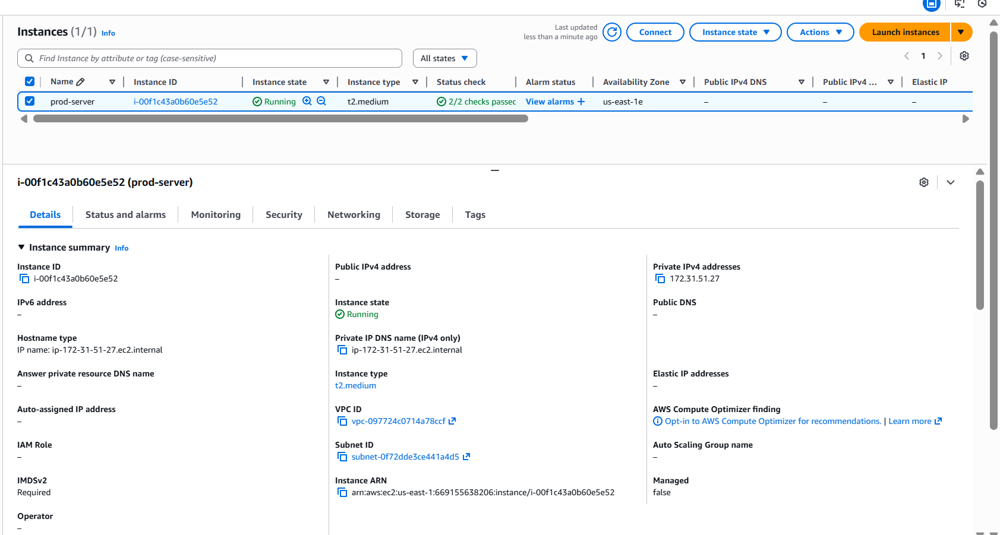
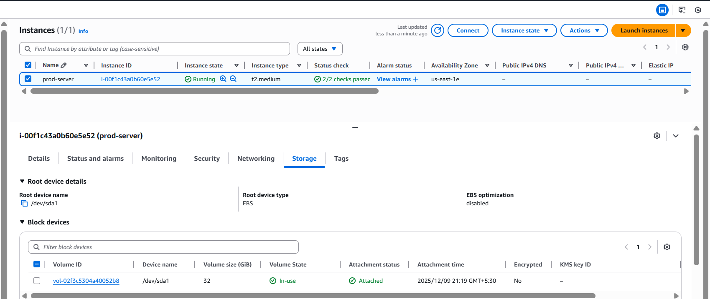
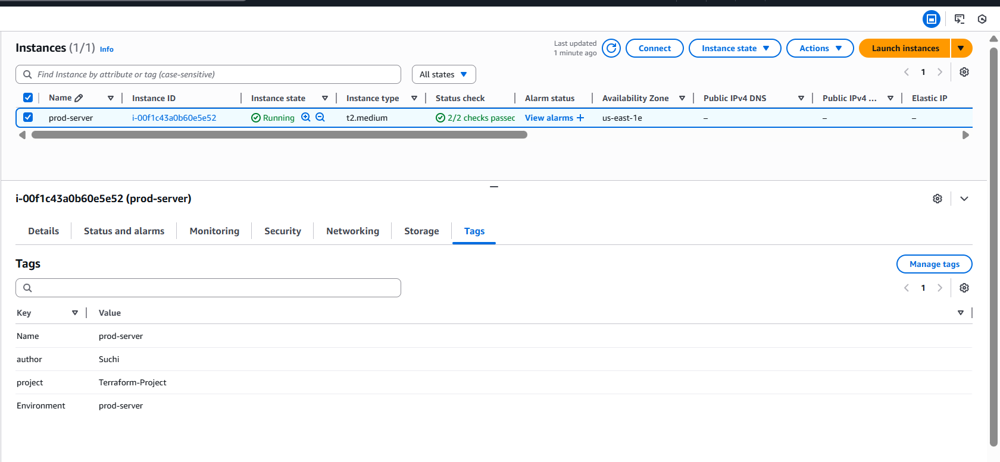
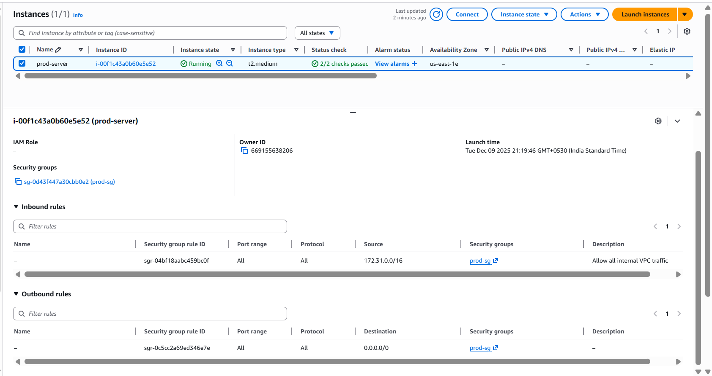
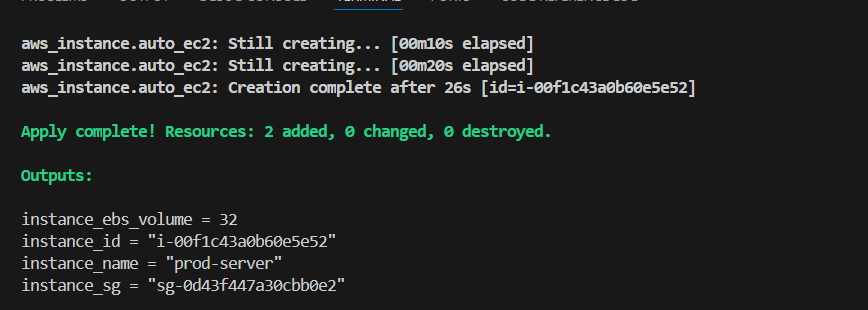
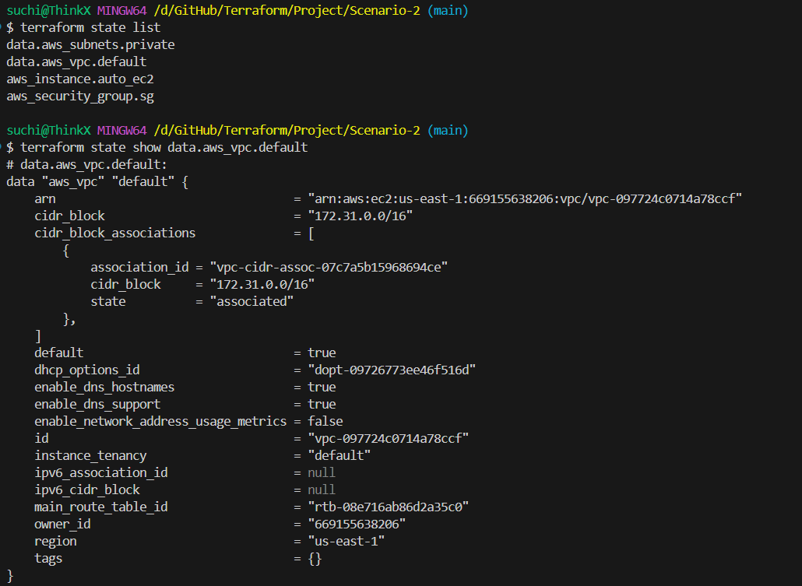

# **Scenario 2: Create complete infra setup for dev/qa/prod using separate tfvars**

In this scenario, we will provision three fully isolated environments — dev, qa, and prod — each with its own:

-Security groups
-Tags
-Instance types
-AMIs
-prod → Ubuntu AMI
-dev/qa → Amazon Linux AMI

All EC2 instances must be launched inside private subnets and must be able to communicate with each other within the same VPC.
Environment-specific configuration (instance type, tags, EBS volume size, etc.) will be supplied through separate tfvars files

(terraform concepts used - variables ,tfvars,output, data)


# **Folder Structure**

```
scenario-2/
    main.tf
    variables.tf
    output.tf
    dev.tfvars
    qa.tfvars
    prod.tfvars
```
**tfvars files should normally NOT be committed** because they may contain secrets.
> In this scenario, our tfvars only contain environment names, so it is safe.
---

# **Steps to Run the Project**

### **1️ Initialize Terraform**

```bash
terraform init
```

---

### **2️ Validate before applying**

```bash
terraform plan -var-file=dev.tfvars
terraform plan -var=qa.tfvars
terraform plan -var=prod.tfvars
```

---

### **3️ Apply according to the environment**

```bash
terraform apply -var-file=dev.tfvars
terraform apply -var=qa.tfvars
terraform apply -var=prod.tfvars
```

---

### **4️ Destroy resources**

```bash
terraform destroy -var-file=dev.tfvars
terraform destroy -var=qa.tfvars
terraform destroy -var=prod.tfvars
```
---

#  **What the Automation Does**

| Environment | Instance Type | Volume Size | Name Tag    | Security Group | AMI (selected)                        |
| ----------- | ------------- | ----------- | ----------- | -------------- | --------------------------------------|
| dev         | t2.micro      | 8 GB        | dev-server  | dev-sg         | Amazon Linux 2 (ami-068c0051b15cdb816)|
| qa          | t2.small      | 16 GB       | qa-server   | qa-sg          | Amazon Linux 2 (ami-068c0051b15cdb816)|
| prod        | t3.large      | 32 GB       | prod-server | prod-sg        | Ubuntu (ami-0ecb62995f68bb549)        |


Terraform dynamically assigns these values based on conditional logic — **no repetitive code needed**.

---

# **Validation (Example with prod environment)**

Running:

```bash
terraform apply -var="environment=prod"
```

Terraform correctly produced:


### **Instance Type**



---

### **EBS Volume**



---

### **Tags**



---

### **security-group**



---

### **AMI**


---
### **Output**



---

### **State Validation via CLI**

You can confirm values using:

```bash
terraform state list
terraform state show aws_instance.auto_ec2
```



---

