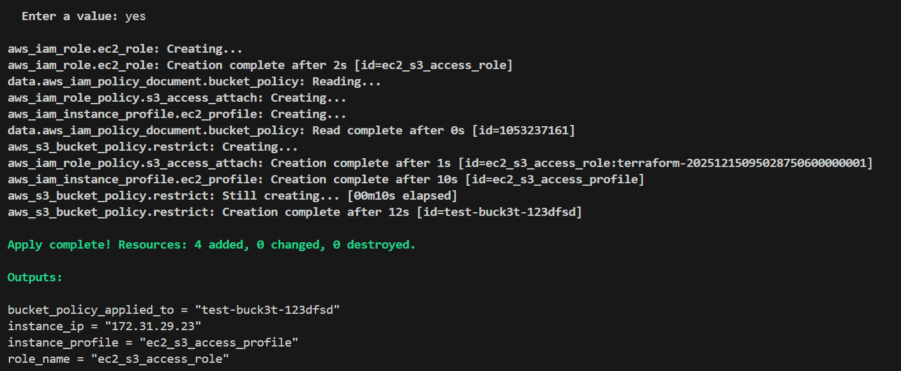
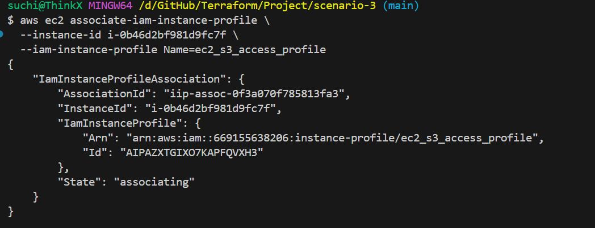
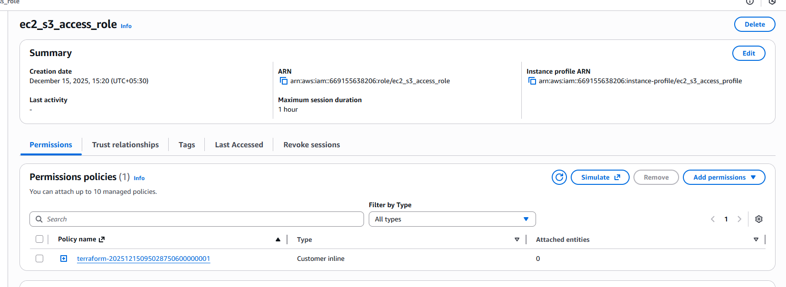
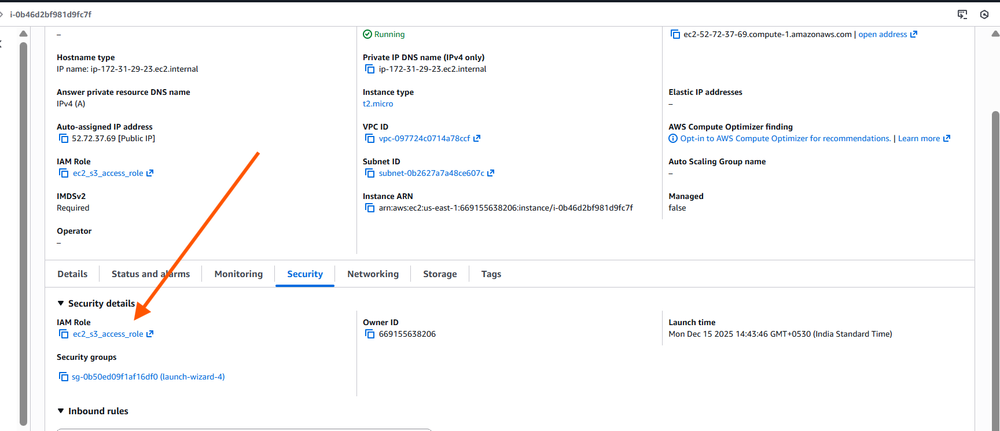
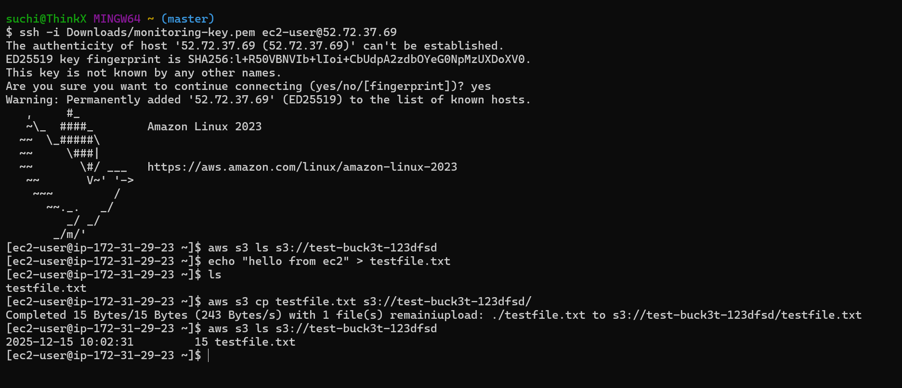
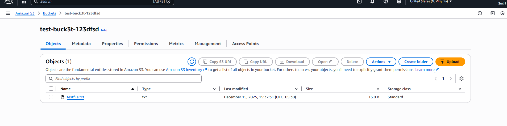

# **Scenario 3: Import existing EC2 & S3 resources and restrict S3 access only from EC2**

Existing EC2 instances and S3 buckets are already created by teams.
We must import them into Terraform and enforce IAM instance profile so bucket access is allowed only from EC2.

(Tools used: terraform import, IAM Role, IAM instance profile, IAM Role Policy, S3 bucket policy)

# **Architecture Overview**

```
EC2 Instance
     │
     │ assumes
     ▼
IAM Role (ec2_s3_access_role)
     │
     │ attached via
     ▼
IAM Instance Profile (ec2_s3_access_profile)
     │
     │ permissions
     ▼
IAM Role Policy → Allows S3 GetObject / PutObject
     │
     │ restricted by bucket policy
     ▼
S3 Bucket (ONLY this EC2 Role can access)
```

---

# **Goal**

You already have:

* **EC2 instance:** `existing_ec2`
* **S3 bucket:** `existing_bucket`

Terraform must:

1. **Create an IAM Role** that EC2 can assume
2. **Create an IAM Policy** allowing

   * `s3:GetObject`
   * `s3:PutObject`
3. **Create an IAM Instance Profile**
4. **Update the S3 Bucket Policy** so **only this EC2 role** can access the bucket

This is the **AWS-recommended** method for secure EC2 → S3 access.

---

# **IMPORTANT AWS LIMITATION **

AWS **does NOT allow Terraform to attach an IAM Role or Instance Profile to an existing EC2 instance.**

Therefore:

### Terraform can create

* IAM Role
* IAM Instance Profile
* IAM Policies
* S3 Bucket Policy

### Terraform cannot attach the role to an already running EC2

This must be done **once manually** using AWS CLI:

```bash
aws ec2 associate-iam-instance-profile \
  --instance-id i-0abcd1234567890 \
  --iam-instance-profile Name=ec2_s3_access_profile
```

After this one-time association,
Terraform + S3 Bucket Policy take full control.

---

# **EC2 → S3 Access Flow**

| Component            | Purpose                                      |
| -------------------- | -------------------------------------------- |
| **IAM Role**         | EC2 assumes this role                        |
| **IAM Policy**       | Grants S3 Get/Put permissions                |
| **Instance Profile** | Required layer between EC2 and IAM Role      |
| **EC2 instance**     | Now uses IAM-based permissions automatically |
| **Bucket Policy**    | Ensures ONLY this EC2 IAM Role can access S3 |

---

# **Steps to Run**

---

## **1️ Initialize Terraform**

```bash
terraform init
```

---

## **2️ Validate before applying**

```bash
terraform plan \
  -var="ec2_instance_id=i-0abcd1234567890" \
  -var="s3_bucket_name=my-app-bucket"
```

---

## **3 Apply the configuration**

```bash
terraform apply \
  -var="ec2_instance_id=i-0abcd1234567890" \
  -var="s3_bucket_name=my-app-bucket"
```


Terraform will now create:

✔ IAM Role
✔ IAM Policy
✔ IAM Instance Profile
✔ S3 Bucket Policy

---

## **4️ REQUIRED: Attach IAM Instance Profile to the existing EC2 (AWS limitation)**

AWS requires a manual or CLI-based attachment:

```bash
aws ec2 associate-iam-instance-profile \
  --instance-id i-0abcd1234567890 \
  --iam-instance-profile Name=ec2_s3_access_profile
```


Once done:

-EC2 now has permission to access S3
-Bucket policy restricts access to ONLY this role
-Terraform owns and manages the entire setup


## validation

1. IAM Role



2. IAM Instance Profile



3. S3 Bucket Policy


4. validation



