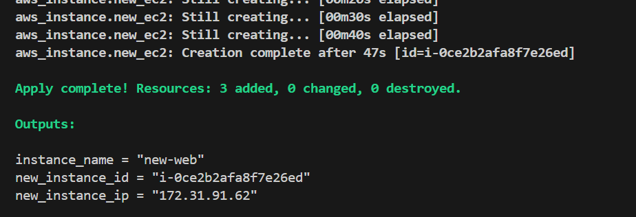
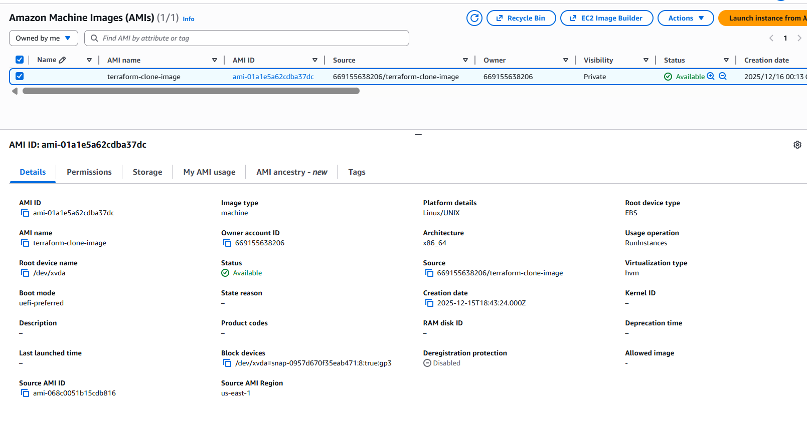
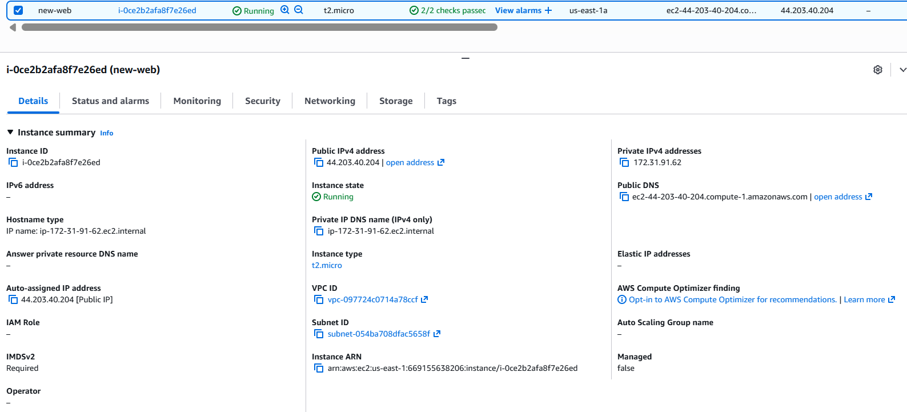
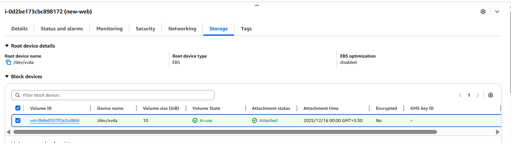
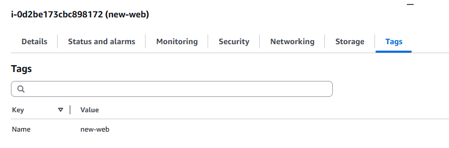
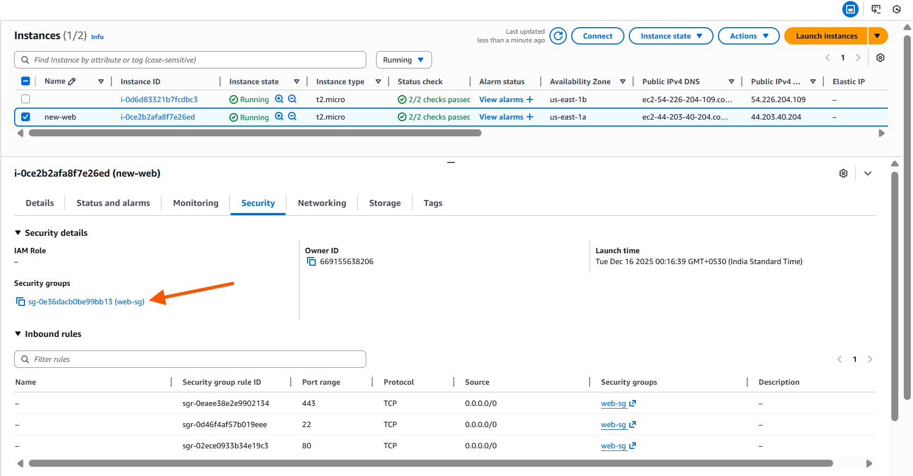
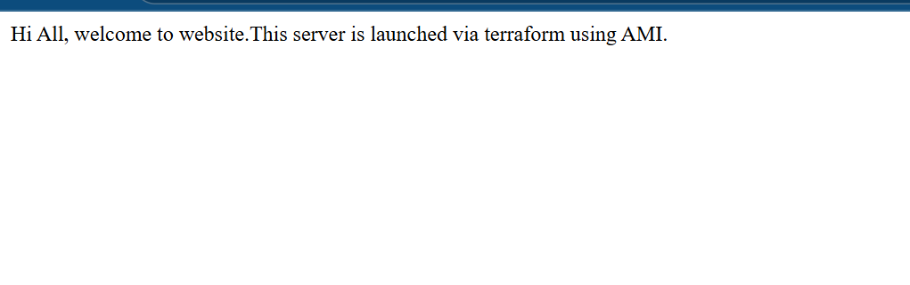

# **Scenario 4: Create AMI from existing EC2 instance and launch new instance using that AMI**

Import an existing EC2 instance → create AMI → use the generated AMI to launch a new EC2 instance.

(Tools used:data block, ws_ami_from_instance, EC2, user_data, security groups)


# **Steps to Run the Project**

### **1️ Initialize Terraform**

```bash
terraform init
```

---

### **2️ Validate before applying**

```bash
terraform plan -var-file=input.tfvars
```

---

### **3️ Apply according to the environment**

```bash
terraform apply -var-file=input.tfvars
```
---

### **4️ Destroy resources**

```bash
terraform destroy -var-file=input.tfvars
```
---

#  **What happens**

1. **Import an existing EC2 instance into Terraform**
2. **Create a reusable AMI** (image) from that instance
3. **Use the AMI to launch a new EC2 instance**
4. **Install Apache (httpd)** using user-data (ensuring cloud-init runs correctly)
5. **Apply security groups and tags to the new instance**
---

# **Validation (Example with prod environment)**

Running:

```bash
terraform apply -var-file=input.tfvars
```

### **output**



### **AMI**



---

### **Ec2 instance**



---
### **EBS**



---
### **Tags**



---
### **Security group**



---

### **validation**



---
# **IMPORTANT – Why User Data Must Be Forced to Execute Again**

When you create an AMI from an **already running EC2**, the cloned system contains cloud-init history.
Amazon Linux will **NOT run user_data** again unless you reset cloud-init.

Your script must include:

```bash
rm -f /var/lib/cloud/instance/boot-finished
cloud-init clean --logs
```

This ensures httpd gets installed and the website loads properly.

