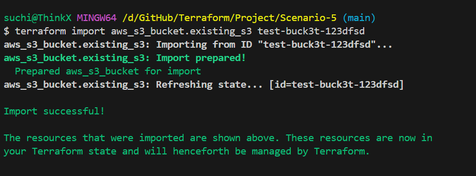
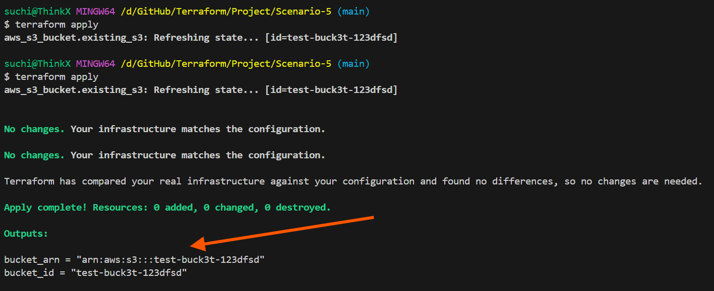

# **Scenario 5: Import an Existing S3 Bucket (Created Manually by App Team) Into Terraform**

Sometimes application teams create AWS resources manually — in this case, an **S3 bucket** used for storing application logs.

our responsibility is to :

✔ Bringing the manually-created bucket under Terraform management
✔ Extracting the **ARN** for documentation
✔ Enabling Terraform to track and manage the bucket going forward

You only know the **bucket name**, so you must use **terraform import**.

**Tools used:** `terraform import`, `aws_s3_bucket`, `data source`, `outputs`

---

# **Steps to Run the Project**

---

## **1️ Initialize Terraform**

```bash
terraform init
```

---

## **2️ Import the existing S3 bucket**

Replace `<bucket-name>` with the bucket created by the app team.

```bash
terraform import aws_s3_bucket.existing_s3 <bucket-name>
```

This command maps the **real AWS bucket** to your Terraform state.

---

## **3️ Validate the configuration**

```bash
terraform plan
```

This shows whether Terraform is in sync with the imported bucket.

---

## **4️ Apply (if required)**

```bash
terraform apply
```

Terraform will not recreate the bucket; it simply manages it now.

---

# **Validation**

---

## ** Import success**



---

## ** Output showing Bucket ARN**



---
