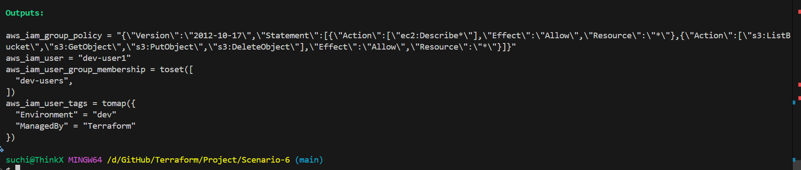
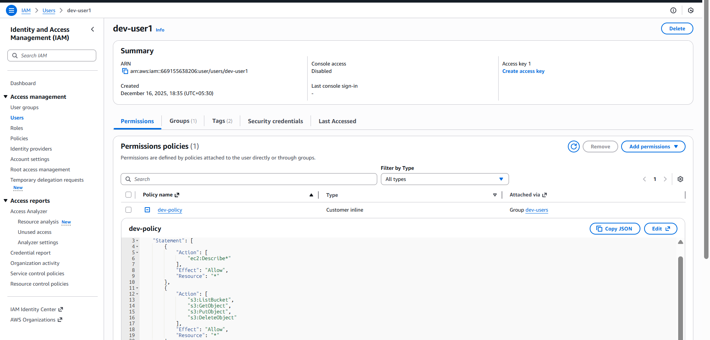
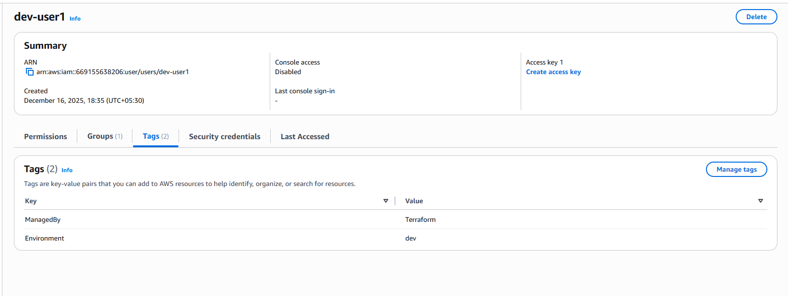

### **Scenario 6: IAM User Access Based on Environment (Dev / QA / Prod)**

Different teams in an organization require different levels of AWS access depending on the environment they work in.

## **Requirements**
Dev users → EC2 + S3 read/write
QA users → EC2 + S3 read-only
Prod users → EC2 read-only, NO delete
All users must belong to environment-specific groups , permissions must be applied at the group level.

## **Terraform Concepts Used**
-IAM Users
-IAM Groups
-Inline IAM Group Policies
-Conditional logic using locals
-Variables and .tfvars
-Outputs for validation

## **workflow**

1. Terraform creates an **IAM group** based on the selected environment (`dev`, `qa`, or `prod`)
2. A **custom IAM policy** is dynamically generated using conditional logic
3. The policy is attached to the environment-specific group
4. An IAM user is created
5. The user is automatically added to the correct group
6. Access permissions are inherited through the group

This ensures **least-privilege access** with zero manual intervention.

```bash
terraform fmt
terraform validate
terraform init
terraform plan -var-file=dev.tfvars
terraform apply -var-file=dev.tfvars
```








