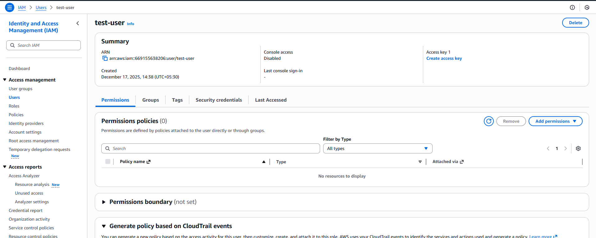
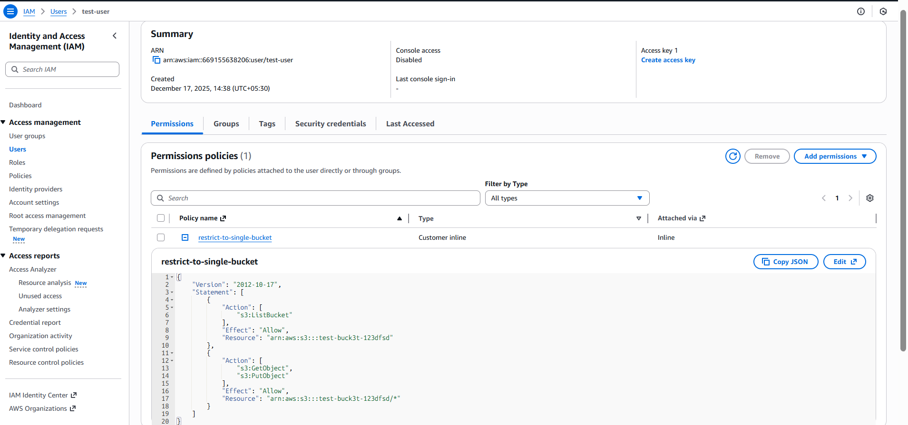
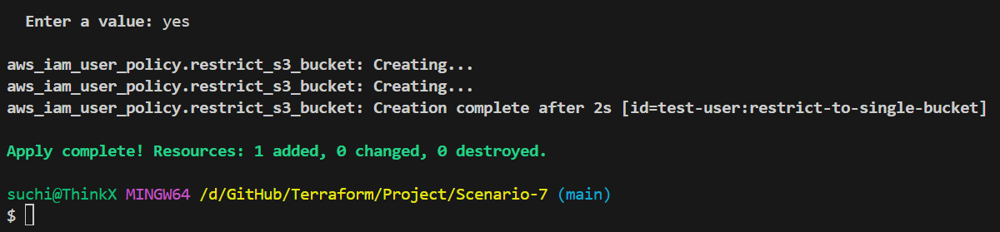

 **Scenario 7: Restrict IAM User Access to a Single S3 Bucket**

## **Problem Statement**

In some environments, an IAM user must be restricted to access **only one specific S3 bucket** and must not be able to view or interact with any other S3 buckets in the account.

This scenario demonstrates how to enforce **bucket-level access control** using Terraform.

---

## **Requirements**

* The IAM user:

  * Can **list objects** in the bucket
  * Can **get and put objects** inside the bucket
* Access must be limited to:

  * **Only the bucket name provided by the administrator**
* The user:

  * Must **not see or access any other S3 buckets**


## **Terraform Concepts Used**

* IAM user data source
* IAM identity-based policy
* Resource-level permission restriction
* S3 bucket ARN and object ARN (`bucket/*`)
* Terraform variables (`.tfvars`)

## **steps**

```bash
terraform fmt
terraform validate
terraform init
terraform plan -var-file=input.tfvars
terraform apply -var-file=input.tfvars
```

## **Validation**

### Before Apply 



### After Apply



### output 


