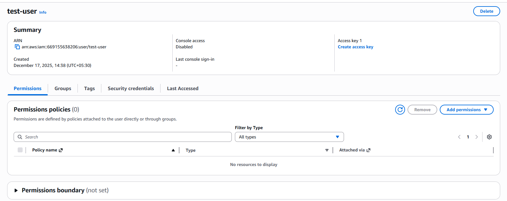
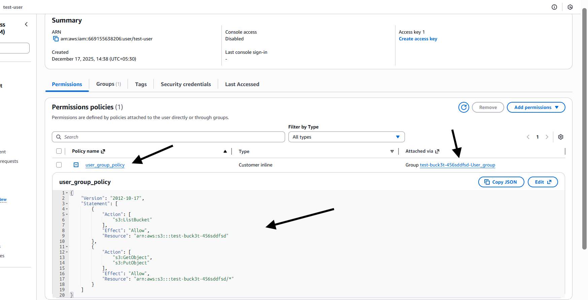
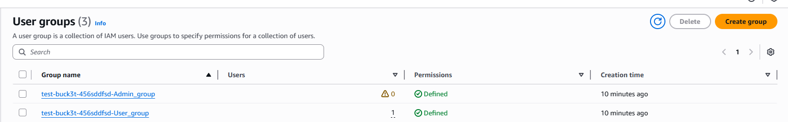
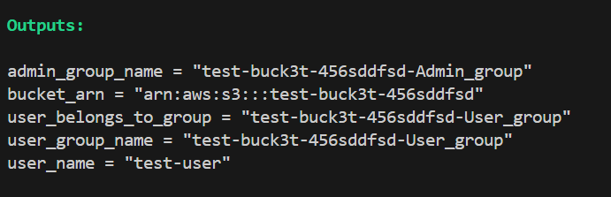
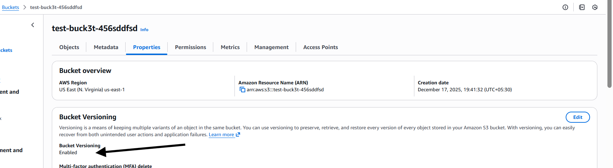
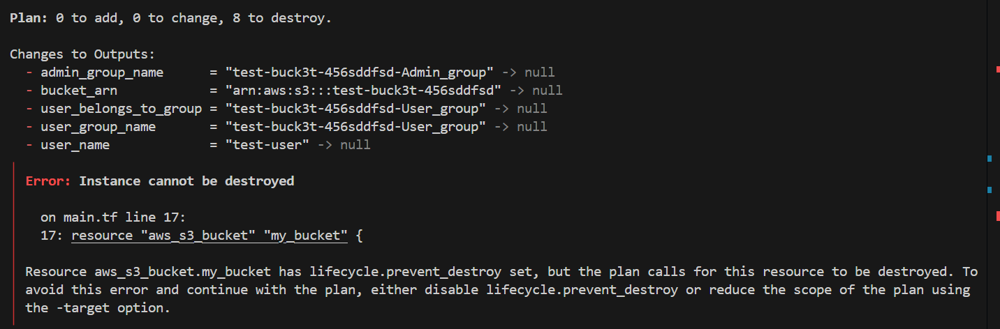

# **Scenario 8: Prevent Accidental Deletion of S3 Resources**

## **Problem**

Critical S3 buckets must be protected from accidental deletion and data loss caused by:

* Human error
* Misconfigured Terraform destroy operations
* Unintentional object deletion

---

## **Solution**

Secure the S3 bucket by:

* Enabling **S3 Versioning**
* Applying **Terraform lifecycle protection (`prevent_destroy`)**
* Configuring **lifecycle rules** for recovery and cleanup

---

## **Terraform Concepts Used**

* `lifecycle { prevent_destroy = true }`
* `aws_s3_bucket_versioning`
* `aws_s3_bucket_lifecycle_configuration`
* IAM Groups & Policies
* Variables & tfvars
* Outputs

---

## **What This Automation Does**

* Creates an S3 bucket
* Prevents bucket deletion via Terraform
* Enables object versioning for data recovery
* Adds lifecycle rules for non-current versions
* Creates two IAM groups:

  * **Admin Group** → Full S3 access
  * **User Group** → Limited object-level access
* Assigns an existing IAM user to the appropriate group

---

## **Steps to Run**

```bash
terraform fmt
terraform validate
terraform init
terraform plan -var-file=input.tfvars
terraform apply -var-file=input.tfvars
```

---

## **Validation**

### **Before Apply**



---

### **After Apply**



---

### **IAM Groups Created**



---

### **Terraform Outputs**



---

### **S3 Bucket Validation**



---
#### **prevent from deletion**


if you really want to delete the s3 bucket,remove lifecycle rule or else commment it out.
---

## **Notes**

* `prevent_destroy` protects only against **Terraform-based deletion**
* Versioning ensures **object-level recovery**
* This setup follows **AWS best practices** for S3 data protection


### 🔐 Terraform Project: Prevent Accidental Deletion of S3 Resources 🚀

In real-world environments, **data loss is often caused by human error**, not outages.

Built a production-style Terraform setup to **protect critical S3 buckets** from accidental deletion and data loss.

🔹 **Problem statement**
Critical S3 buckets must be protected from:
• Accidental `terraform destroy`
• Human errors
• Unintentional object deletion

🔹 **What this project implements**
• S3 Versioning for object-level recovery
• Terraform `prevent_destroy` lifecycle protection
• Lifecycle rules for non-current version cleanup
• IAM access separation:

* Admin group → Full S3 access
* User group → Restricted object-level access

🔹 **Key takeaway**
Terraform alone cannot guarantee data safety — **combining AWS-native controls with Terraform lifecycle rules is essential**.

🔹 **Terraform & AWS concepts used**
S3 versioning · lifecycle rules · prevent_destroy · IAM groups & policies · tfvars · outputs

📂 **GitHub Repo:** [https://lnkd.in/xxxxx](https://lnkd.in/xxxxx) *(replace link)*

Learning Terraform the real-world way — focusing on **data protection, safety, and production constraints**, not just resource creation.

#Terraform #AWS #S3 #DevOps #InfrastructureAsCode #CloudSecurity #LearningInPublic #cfbr #OpenToWork


