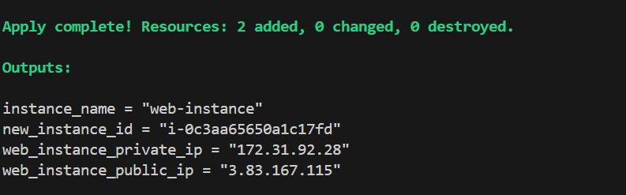
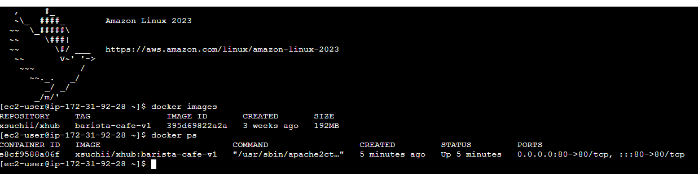

# **Scenario 9: Automate Container Deployment on EC2**

In this scenario, Terraform is used to **provision an EC2 instance and automatically deploy a Dockerized application** using **EC2 user data**.

During instance boot:

1. Docker is installed
2. A container image is pulled from Docker Hub
3. The container is started automatically and exposed via port **80**

This demonstrates **infrastructure provisioning + application bootstrap** in a single Terraform workflow.

---

## **Tools & Concepts Used**

* Terraform
* AWS EC2
* AWS User Data
* Docker
* Linux (Amazon Linux)
* Security Groups

---

## **Steps to Run**

```bash
terraform fmt
terraform validate
terraform init
terraform plan -var-file=input.tfvars
terraform apply -var-file=input.tfvars
```

---

## **Validation**

### **output**



---
### **website**


---
### **container**


